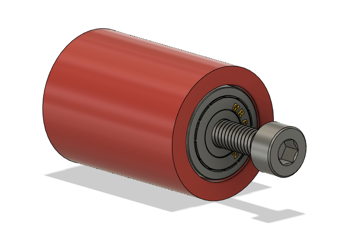
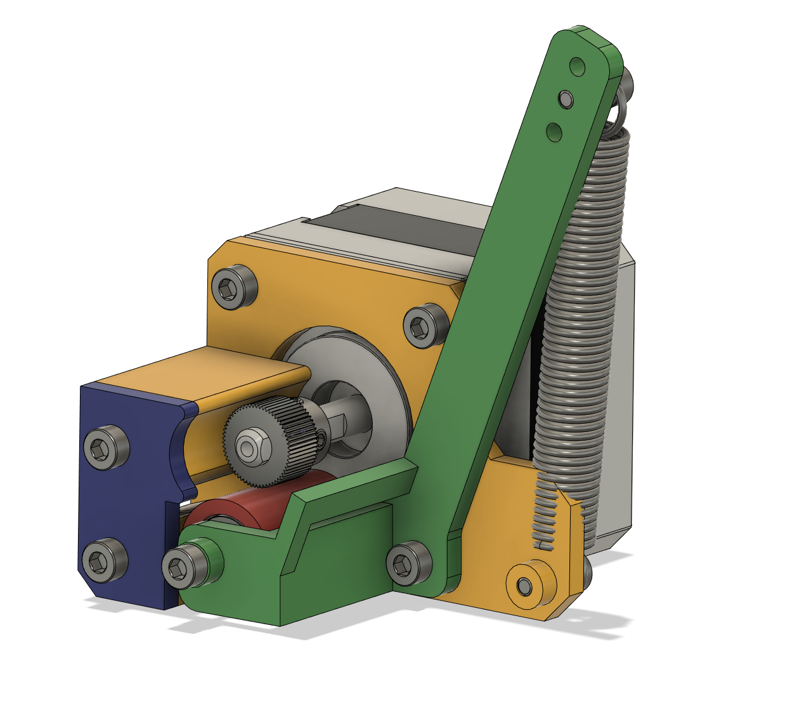
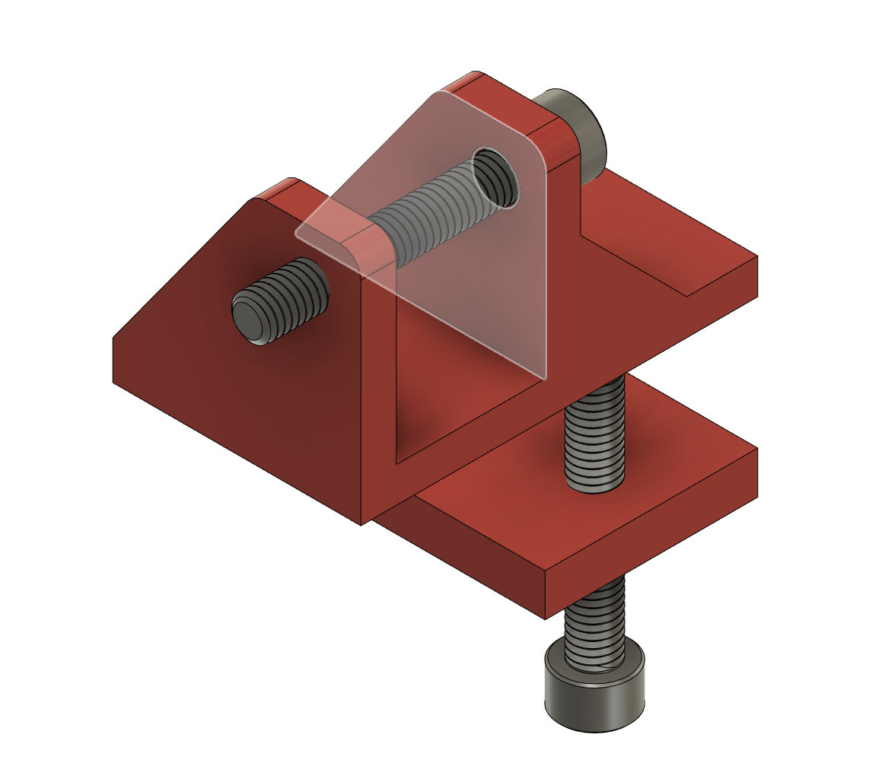
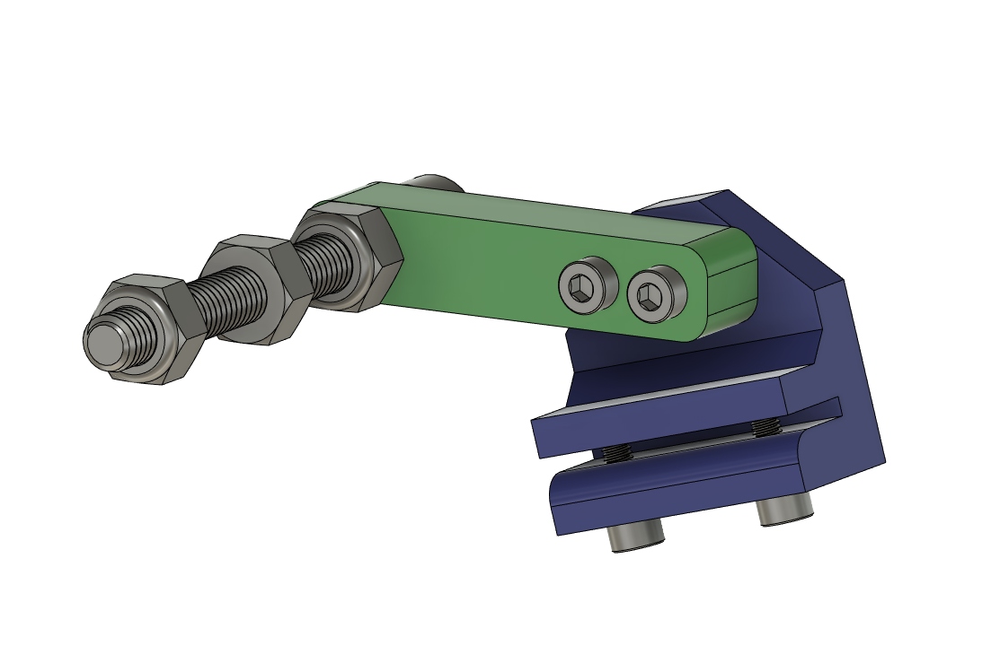
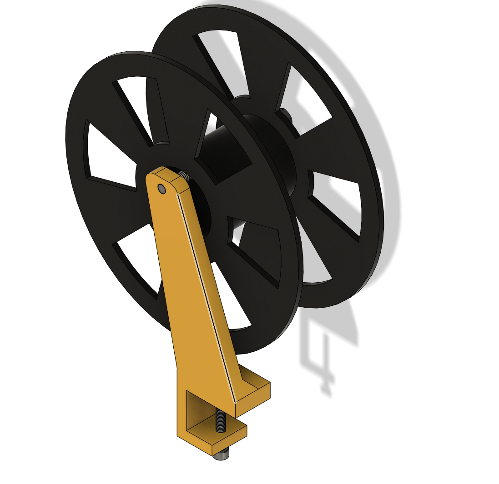

# Automated Elastic Band Cutter

This machine was created during the 2020 Covid-19 pandemic to cut elastic bands for 3D-printed faceshields. I used stuff I had lying around to build the machine as fast as possible so it might not be the fastest, best and prettiest design, but I thought I'd share the design anyways as Inspiration for other people in need of a similar machine.

It is licensed unter CC-BY. Feel fee to use, share and modify the design to your needs.

## Bill of Materials

### Hardware
* 1 Paper / Photo Cutter (I used an old [Olympia Vario duplex 4600](https://www.amazon.de/Olympia%C2%AE-Papierschneider-Vario-duplex-4600/dp/B078HTYYCR) wich is sadly no longer available)
* 1 [Nema17 2-Phase Stepper](https://www.aliexpress.com/item/4000329570564.html) (I used a cheap 1A version)
* 1 Stepper Driver (e.g. [DRV8825](https://www.aliexpress.com/item/4000857272596.html))
* 1 [Arduino Nano CNC Shield](https://www.aliexpress.com/item/32811233196.html)
* 1 [Arduino Nano](https://www.aliexpress.com/item/32866959979.html)
* 1 [L298D Motor Driver](https://www.aliexpress.com/item/32994608743.html)
* 1 [12V 2A Power Supply](https://www.aliexpress.com/item/33014935336.html)
* 1 [12V Linear Actuator](https://www.aliexpress.com/item/4000655541787.html) (Mine has 200mm stroke length and 750N)
* 1 [3D-Printer Extruder Wheel](https://www.aliexpress.com/item/32903294855.html) (I used the 26
 teeth steel version because of its coarse teeth)
* 2 [623 Roller Bearings](https://www.aliexpress.com/item/32434009843.html)
* 1 [Small Spring](https://www.aliexpress.com/item/4000422954444.html) (approx. 50mm length)
* Some metric nuts and bolts (Sorry America). I used lots of M3 screws for the "extruder", M6 Hardware for clamping the brackets to the picture trimmer and one M8x100 screw for the filament holder)
* Old Filament Spools for winding up the band
* Some wires for hooking it all up

### Printed Parts
Just print all .stl files in the CAD/STL folder. I used PET-G with 4 Perimeters, 0.5mm layer height and 15% infill with a 0.8mm nozzle for all parts. If you are using a 0.4mm nozzle, the layer height should not exceed 0.3mm

## Assembly
The machine consists of three subassemblies. The extruder for advancing the band forward, the cutter for actually cutting the tape and a spool holder for the spools.
### The Extruder

Start by pressing the Bearings into the idler roller (red). After that, install the roller into the idler lever (green) using a M3x30 screw.

Install the NemaPlate (yellow) on the stepper with M3x6 screws. Use one M3x8 Screw to fix the idler lever to the stepper. Don't tighten the screw too much or the lever won't be able to move. Use some Loctite if the screw comes loose after some time.
After that, you can install the cover plate and the spring as shown in the picture.
You can adjust the spring tension by using different holes at the end of the lever.
I just taped the extruder motor to the surface of the paper cutter.
Make sure you place it near the axis of rotation
### The Cutter

Assemble the lower bracket as shown in the picture. The lower screw is used to fix the bracket to the picture cutter. The upper screw mounts the linear actuator to the bracket.

The upper bracket consists of two printed parts that need to be joined together using M3x8 screws. Fix to the linear actuator using a M6x60 screw an nylon locknuts.
### The Spool Holder

Use a M6x40 Screw to clamp the spool holder to the picture cutter. The spool is hanged from a M8x100 screw that needs to bee installed at the top.

### Electronics

TODO: Schematic

Install the Arduino and the stepper driver on the shield. Use the Z-Axis stepper socket. Connect MOT_GND and MOT_VCC of the shield to the L298's power supply and connect pins 12 and 13 on the shield to the IN1 and IN2 pin of the L298. Afterwards, use the screw terminals on out1 and out2 to connect the linear actuator.

### Code
Just flash the code provided in the "Code" directory to the Arduino. The length of the band is set via the `BAND_LENGTH` define in the Sketch. A means of setting the length via a display and encoder would be great but is not available yet.

If your cuts turn out to be to long or short, try modifying the `stepsPerMM` define to tweak the band length.

## Thanks

Models used in the CAD file
https://grabcad.com/library/623-zz-e3d-titan-idler-bearing-1
